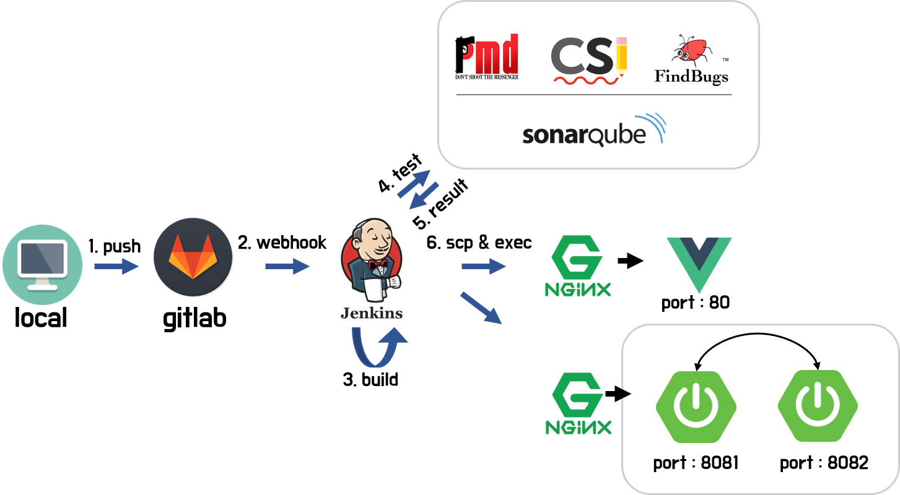

# ✏️ SNS 기반의 모바일 웹 어플리케이션 : Just DDA IT! 📚

> 팀명 : 원기옥
>
> 팀장 : 김진혁
>
> 팀원 : 곽세경, 박형민, 이유진, 허예슬
>
> 프로젝트 기간: 2020.07.13 ~ 2020.08.21


## 0. 배포 서버 URL

:iphone: [Just DDA IT 바로가기](http://i3a102.p.ssafy.io/)


## 1. 사용 기술

```
OS : Windows 10(develop), Ubuntu 18.04.1 LTS (deploy)
IDE : Visual Stuid Code, Spring Tool Suite 3, IntelliJ
DB : MariaDB
Language : Java 1.8 , JavaScript
Browser : Chrome / 아래 참고
Framework : Spring, Vue, JPA
Etc : Docker, Nginx, Jenkins, Sonarqube(pmd,checkStyle,findBugs)
```

[지원 브라우저](https://kangax.github.io/compat-table/es6) 


## 2. 팀구성

| person       | 역할                                  | 세부사항                               |
| ------------ | ------------------------------------- | -------------------------------------- |
| 김진혁(팀장) | 팀장, FE | 자격증 탭 FE, gitlab, jira, 일정 관리  |
| 곽세경       | FE, 디자인                            | 홈 탭 FE, 스터디 탭 FE, ux ui & ppt    |
| 박형민       | BE                                    | BE, CI&CD, 배포                        |
| 이유진       | BE                                    | BE, DB 모델링                          |
| 허예슬       | FE, UCC 제작                          | 마이스터디 탭 FE, 설정 탭 FE, ucc 제작 |

:books: [원기옥 팀 일정관리 및 회의록 노션](https://www.notion.so/21a656191137455fae7d07498f997d29)


## 3. 프로젝트 개요

- **공공데이터포털 API** 기반 자격증 정보 제공한다.
- 언택트 시대에 알맞는 **모바일 스터디 룸을 제공**한다.
- **SNS 기반**의 스터디 룸으로 팔로우, 팔로잉, 좋아요 및 댓글을 통해 유저간의 소통이 가능하다.
- 개인탭을 통해 **개인별 일정관리와 자격증 관리가 가능**하다.
- **사용자의 데이터를 바탕으로 추천 알고리즘**을 통해 자격증을 추천해주고 사용자가 필요로 하는 유용한 정보를 제공한다.


## 4. ERD 모델링 및 와이어 프레임


## 5. 상세 페이지


- 홈 탭
  - 24시간 동안 가장 좋아요을 많이 받은 유저, 피드 순위 제공
  - 일주일 동안 피드 개수가 가장 많은 스터디방 추천
  - carousel 을 이용한 유저들의 흥미를 유발하는 광고 배너


- 자격증 탭

  - 공공데이터포털에서 제공하는 API를 사용하여 정확한 자격증 정보 제공

    (국가기술자격 종목별 시험정보 API, 국가기술자격 통계 정보 API, 국가기술자격 취득 관력 현황 API, 국가기술자격 종목 정보 API)

  - 유저의 데이터와 알고리즘을 통해 자격증 추천 서비스 구현
  - 유저에게 자격증 관련 정보 제공
  - 자격증 리뷰 CRD 


- 스터디룸 탭
  - 자격증 기반의 스터디 룸 CRUD (공개, 비공개 가능)
  - 자격증, 방장, 키워드를 통한 스터디룸 검색 가능, 유저 이름을 통한 유저 프로필 검색 가능
  - 단체 일정 CRUD 및 공유 가능, 개인 일정 checking 가능
  - 피드 CRUD, 피드 좋아요 및 댓글 CRUD


- 마이스터디 탭

  - 유저만의 개인 일정 checking 가능, 모든 일정 읽기 가능

  - 유저만의 스터디룸, 피드 모아보기 가능

  - 유저만의 자격증 관리 가능

    (자격증 준비 예정, 준비중, 취득완료)

  - 팔로우, 팔로잉 기능 구현


- 회원관리
  - 이메일 인증을 통한 회원가입
  - 이메일 인증을 통한 비밀번호 찾기
  - 로그인, 로그아웃
  - 회원 탈퇴


## 6. Execution

##### <span style="color:red">Local에서 실행 시, develop 브랜치의 코드로 진행하세요. </span>
> ---

##### Docker가 없을 경우
##### [도커 설치](https://www.docker.com/get-started)  
---

### DB

**cmd**창이나 **terminal**창을 켠뒤, 다음 명령어 입력.  
만약, 실행환경이 **linux** 환경이라면 아래 명령어를 입력하기 전에 `sudo su` 명령어를 입력한다.

```command
> docker run --name {DB 컨테이너 이름} -p 3306:3306 -e MYSQL_ROOT_PASSWORD={비밀번호} -d mariadb    # mariadb서버 생성
> docker exec -it maria-db mysql -u root --password={비밀번호}                                     # db서버 접속
```
그러면 DB에 접속이 된다.  
이제 다음 명령어를 입력해 skeleton이라는 데이터베이스를 생성한다.

```
MariaDB [(none)] > CREATE DATABASE SKELETON    # database 생성
MariaDB [(none)] > QUIT    # DB 빠져나오기
```


JPA를 통해 테이블을 생성할 것이기 때문에 DB는 추후 자격증 정보를 넣을 때 까지 신경쓸 필요가 없다.
### Backend
src/main/resources/application.properties에 들어간다.  
아래 내용만 수정한다. (안에 있는 정보 악용 금지!)  

```
(생략)
spring.datasource.url=jdbc:mysql://{DB 서버 주소}:3306/skeleton?(~이하 생략~)
spring.datasource.username=root
spring.datasource.password={DB 비밀번호}
(생략)
```


그리고 IDE에서 src/main/java/com/ssafy/study/**StudyApplication**을 Run 시킨다. ~~끝이다~~  

STS나 IntelliJ와 같은 IDE를 사용할 것을 추천하나, 피치 못할 사정으로 CLI방식으로 해야한다면...😭  
application.properties를 똑같은 형식으로 수정한 뒤, backend 디렉토리에서 command 창을 연다.

```
> mvn clean install   # !! mvn이 없으면 설치해야 함.
```

위 명령어를 통해 빌드를 한 뒤, 직접 웹 서버를 사용해 jar파일을 실행해야 한다.
docker를 사용하는 사람을 위해 Dockerfile을 만들어 놨으니(~~사실 내가 쓰다가 지우기 귀찮아서 놔둠...~~) docker를 사용한다면 다음과 같은 방법을 사용해도 된다.

```
> docker build -t {이미지 이름} -f Dockerfile ./
> docker run --name {서버 container 이름} -p 8080:8080 -d {이미지 이름}
```

이렇게 하면 8080포트로 백엔드 서버를 실행 시킬 수 있다.
##### 참고 - [도커 빌드 관련](https://docs.docker.com/engine/reference/commandline/build/)
### Frontend
console창에 npm 명령어를 통해 서버를 실행한다.

```
> npm install
> npm run serve
```

### DB에 데이터 넣기
정상적인 서비스를 사용하기 위해서 자격증 정보를 DB에 넣어야한다.  
다음에 나올 내용들은 CLI환경에서 데이터를 넣는 방법으로, 조금 복잡해 나름 최대한 친절하게 설명해보겠다. GUI환경이라면 구글링을 통해 보다 더 간단하게 할 수 있다.
우선 아래 2개의 csv파일을 다운 받는다.  
##### [자격증1](https://lab.ssafy.com/s03-webmobile2-sub3/s03p13a102/blob/master/forREADME/licenses_for_db.csv)
##### [자격증2](https://lab.ssafy.com/s03-webmobile2-sub3/s03p13a102/blob/master/forREADME/field_info_all_output_for_db.csv)
---
DB서버를 배포하고 있는 환경에 다운을 받을 수 있으면 좋으나 CLI 환경에서 `wget`이나 `curl` 과 같은 command가 gitlab의 인증 문제 때문인지 실행이 되지 않는다.  
그래서 이를 해결 할 두가지 방법을 간단히 설명하겠다.  
1. 배포 환경에서 git clone을 사용
      - git repository에 접근이 가능한 gitlab 계정이 필요하다. (아마 이 README.md 파일을 보고있다면 가능할 것이다.)
      - [git 일부 디렉토리만 clone](https://eventhorizon.tistory.com/20)하는 방식을 통해 해당 파일을 가지고 오면 된다. (전체를 clone해도 무방하다.)
      - 배포 환경에 git이 설치 되어 있어야 한다.
2. scp를 통해 해당 파일만 넘겨주기
      - 배포 환경에 22번 포트가 열려 있어야 하고, pem 키가 필요하다. ip 자체가 차단이 되어있다면 [iptable](https://sata.kr/entry/IPTables-2%ED%8A%B9%EC%A0%95-%EC%95%84%EC%9D%B4%ED%94%BC%EC%9D%98-%EC%B0%A8%EB%8B%A8%EA%B3%BC-%ED%97%88%EC%9A%A9-INPUT)을 사용해서 접속하려는 로컬의 ip를 허용해야한다.
      - 접근 하려는 배포 환경의 디렉토리에 접근 권한을 따로 설정해 주어야 한다.
      - 배포 환경의 디렉토리에 접근 권환을 주어야한다. 배포 환경에서 `chmod {디렉토리} 755`를 한다.
      - 현재 환경에서 `scp -i {pem 키} {자격증.csv} {배포환경 이름}:{디렉토리}` 명령어를 통해 csv파일을 옮길 수 있다.
---
이제 DB 서버를 배포하고 있는 환경에 csv 파일을 가지고 왔다. 하지만 여전히 중요한 문제가 남았다.  
설명을 따라 설치를 했다면 DB서버가 돌아가고 있는 환경은 docker의 container 위다. 이 csv 파일들을 컨테이너 환경으로 다시 옮겨야 하는 작업이 남았다.  
만약 docker를 사용하지 않고 Apache나 다른 서버를 이용해 DB서버를 배포하고 있다면 다음 올 내용들은 생략해도 된다.  
!!만약, linux 서버에서 command를 실행한다면 `sudo su` 명령어를 사전에 입력해주어야한다.  
우선, MariaDB 서버가 돌아가는 container 안에 csv 파일을 넣을 디렉토리를 먼저 만들어주자.  
Maria DB 서버에서 `~/` 경로가 `/home/mysql/`이다. 따라서, 우리는 `/home/mysql/csv` 안에 이 csv 파일들을 넣으려고 한다.  

```
> docker exec -it {DB container 이름} /bin/bash   #DB 컨테이너의 shell(bash)에 접속을 할 건데 가상 tty를 통해 접속하는 명령어다.
```

이렇게 하면 DB container에 접속을 했다. 기본적으로 /home 디렉토리는 있으므로 이후 디렉토리만 생성한다.
```
root@{container id} > mkdir /home/mysql
root@{container id} > mkdir /home/mysql/csv
root@{container id} > exit
```
디렉토리를 생성했으니 해당 폴더에 csv 파일들을 옮겨보자  

```
> docker container cp {csv파일} {DB container 이름}:/home/mysql/csv   #두 개의 csv파일에 대해 각각 실행해준다. * 폴더를 넣어도 된다.
```

이제 csv 파일을 db에서 import를 해야한다. 우선 db 서버에 접속을 해보자.
```
> docker exec -it {DB container 이름} mysql -u root -p{비밀번호}      # -p{비밀번호}는 붙여써야한다.
```
DB서버에 접속을 했다. **참고로, 앞으로의 명령을 실행하기 위해서는 백엔드 서버를 한번이라도 실행을 시켜서 JPA를 통해 테이블이 생성된 상태여야 한다.**

```
 MariaDB [(none)] > USE SKELETON
 MariaDB [(skeleton)] > LOAD DATA INFILE '~/csv/field_info_all_output_for_db.csv'
                      > IGNORE
                      > INTO TABLE license_detail
                      > FIELDS TERMINATED BY '|'  
                      > ENCLOSED BY '"'  
                      > LINES TERMINATED BY '\n' 
                      > IGNORE 1 ROWS 
                      > (id, career, english_name, history, implementation_name, institute_name, license_name, field, field_category, license_series, summary, trend);
 MariaDB [(skeleton)] > LOAD DATA INFILE '~/csv/licenses_for_db.csv'
                      > INTO TABLE licenses  
                      > FIELDS TERMINATED BY ','  
                      > ENCLOSED BY '"'  
                      > LINES TERMINATED BY '\n'  
                      > IGNORE 1 ROWS 
                      > (id,license_series,license_series_name,license_code, license_name, ncs_category_code1, ncs_category_name1,  ncs_category_code2,  ncs_category_name2);
```

이렇게 하면 DB 서버도 모두 준비가 되었다.


## 7. Web Infrastructure


## 간단 설명
aws ec2 서버 위에 docker를 설치 한 후, docker container 위에 3개의 nginx와 jenkins, sonarqube, MariaDB 총 6개의 컨테이너가 올라가있다.  
각각의 컨테이너에 대해 가볍게 알아보자.
### Jenkins
Jenkins는 CI툴로 git 저장소(gitlab)에서 push나 merge와 같은 이벤트가 일어났을 때 webhook을 통해 jenkins에 전달이 되고 자동 통합 및 빌드가 일어난다.  
보다 자세한 내용은 [CI/CD](#cicd)쪽에서 다루겠다.  
##### [Jenkins sever](http://i3a102.p.ssafy.io:8090) 
id : `visitor`  , password : `s03p13a102`
### SonarQube
SonarQube에 있는 pmd, checkStyle, findBugs는 정적 분석 툴로 플러그인 형태로 SonarQube 사이트에 올라가있다.  
Jenkins에서 빌드 성공 시 코드를 정적 분석해주고 결과물을 제공한다.  
##### [SonarQube sever](http://i3a102.p.ssafy.io:8070/dashboard?id=ssafyProject) 
### nginx
3개의 nginx 위에는 프론트엔드 서버, 프록시 서버, 백엔드 서버가 올라가있다.
백엔드 서버는 하나의 nginx 컨테이너에 두 개의 Springboot jar가 다른 포트를 가지고 있어 서비스를 중지하지 않고 배포할 수 있다. 따라서, 프론트 서버에서 백엔드 서버로 요청을 보낼 때 어떤 백엔드 서버의 port가 연결되어 있는지 알 수 없다.  
이 문제를 해결하기 위해 proxy server를 두어 프론트 서버에서 8080포트로 요청을 보내면 proxy 서버가 8080포트로 오는 요청을 8081이 연결 되어 있으면 8081로, 8082가 연결 되어 있으면 8082로 요청을 보낸다.


## 8. CI/CD Flow 



## 9. Overview
CI는 jenkins를 사용하였고 SonarQube와 연동을 하여 코드 정적 분석 기능을 추가하였다.
CD는 nginx를 통해 무중단 배포 서비스를 구현하였다.

### Flow Description
로컬에서 코드를 작성 후 master 브랜치에 push를 하게되면 jenkins에 webhook이 날아가고 jenkins 서버에서 git으로부터 repository을 가지고 온다.  
git에서 정상적으로 가지고오면 jenkins에서 SonarQube 서버에 코드를 보내 검사를 요청한다.  
SonarQube에서 설치된 plugin에 따라 코드의 버그나 취약점 등 코드 분석을 실시한다.  

```
## SonarQube Plug-in  
PMD : 응용 프로그램에서 발견된 문제를 보고하는 오픈 소스 정적 Java 소스 코드 분석기. 문법적으로 오류 가능성이 높은 항목들을 체크해서 알려줌.  
CheckStyle : 코딩 스타일 규칙을 정의하여 체크해줌.  
FindBugs : 정적 분석 제공 툴. 기본적으로 발생할 수 있는 결함을 확인하고 Report해줌.  
```
SonarQube에 통과 기준을 설정해 분석 결과가 기준을 넘기면 **Pass**와 함께 결과를 jenkins에 보내준다.  
Jenkins는 성공 결과를 받으면 코드를 다음 script를 통해 빌드 한다.  
```
Backend는 `mvn clean install`
Frontend는 `npm install` 후, `npm run build`
```
빌드가 완료되면  빌드를 통해 나온 실행 파일 및 디렉토리들을 scp를 통해 aws ec2서버로 보낸다.  
동시에 aws ec2서버에 ssh로 접속해 shell script 파일을 실행시켜 각각 서버를 실행시킨다.

```
Frontend는 docker container를 restart하는 방법을 통해 배포한다.
Backend는 여러 yml 파일들을 통해 8081포트와 8082포트 중 사용되지 않은 포트를 선택하여 구동시키고 다른 포트로 배포되어있는 서버를 종료시킨다.
```


## 10. 느낀점 및 정리

- git 을 이용한 협업을 진행

  - Frontend 와 backend 의 분업이 이루어져서 각자의 브랜치에서 작업을 진행하였다.

  ```bash
  # 브랜치 생성
  $ git branch {branch name}
  
  # 브랜치 목록 조회
  $ git branch
  
  # 브랜치 전환
  $ git checkout {branch name}
  
  # 브랜치 삭제 
  $ git branch -d {branch name}
  
  # 원격 저장소로 푸시전 pull을 하여 conflict 처리한다. 
  $ git pull origin front / backend
  $ git push origin {branch name}
  
  # 충돌 내용 확인
  $ git status
  
  <<<<<< HEAD
  원래 내용
  ===========
  브랜치에서 수정한 내용
  >>>>>>> issue3
  ```

  - merge 작업은 웹을 통해 진행하였다.


- JIra를 이용한 에자일 방식의 프로젝트를 진행

  - 매일 오전 오후 scrum meeting을 통해 각자의 목표와 오늘 해야 할 일을 나누고 피드백하면서 서로 같은 방향의 프로젝트를 진행할 수 있도록 노력하였다.

  - Jira를 이용한 체계적인 스케줄 관리와 개발 순서를 정하는 것은 처음이었다. 처음에는 적응하기 힘들었는데, 각자의 세션이 나누어져있고 그 세션안에서도 다양한 기능들이 있기 때문에 세션별 기능별 나누는 것이 중요하다는 것을 몸소 느끼게 되었다. 세션과 기능을 타고 그 안에서 여러 단계의 이슈를 기록하면서 Jira를 통해 체계적인 프로젝트 관리가 가능하다는 것을 느끼게 되었다. 

  - Jira와 git lab연동이 된다면 커밋에 따라 Jira의 이슈가 자동적으로 활성화된다. 하지만 깃랩 연동에 실패하여 수동으로 Jira의 이슈들을 옮겨야 하는 점이 너무 아쉬웠다.

  - 각자의 기능에만 집중을 하다 보면 서로 작업의 공유도 힘들고 각자의 방향이 틀어질 수 있는데 매일 오전 오후 진행하는 scrum meeting을 통해 전체적인 방향을 놓치지 않고 각자의 작업 현황을 공유하며 상황을 전체적으로 파악할 수 있는 시간이 되어서 좋았다.

    

- FE 와 BE의 분업과 협업을 경험

  - 이전의 프로젝트의 경우 FE, BE 구분없이 fullstack으로 프로젝트를 진행하였는데 처음으로 분리시켜 프로젝트를 진행하였다.
  - 모델링의 중요성을 아주 많이 깨닫게 되었다. 모델링을 먼저 완벽하게 짜고 프로젝트를 진행하였다면  BE와의 소통에서 덜 불편함을 겪었을 것 같다. 완벽하지 않은 모델링과 component 구성과 설계를 제대로 짜지 않고 기능부터 구현하려고 하다 보니 결국 DB를 엎고 수정해야 하는 어려움을 겪었다. 
  - 통신을 할 때에 어떤 Method를 사용하고, data를 어디에 담아 줄 것인지 후에 정하게 되면서 통신에서 오랜 시간이 걸렸던 것 같다.
  - 촉박한 마음에서 급하게 프로젝트를 진행하지 않았나 하는 생각이 든다. 뭐든 기초를 탄탄하게 만든 다음 진행해야 한다.


- 배포 후 알게된 통신 속도
  - 성능 최적화를 전혀 고려하지 않고 개발을 진행한 것 같다. 배포 완료한 사이트의 통신 속도가 너무 느렸다. 웹 성능에 대한 최적화를 고려하고 개발을 한다는 것이 중요하다는 것을 알게되었다.
  - UX UI 측면에서 로딩이 진행되면 로딩에 따른 표시를 해준다면 속도감을 덜 느꼈을 건데 그 부분을 놓친 것 같다.


- 아쉬운 점
  
  - 배포와 CI/CD를 직접 해보지 못한 것에 대한 아쉬움이 남는다. 그와 관련된 CS지식을 공부해서 전체적인 과정을 이해하고 싶다.
  - 급한 마음에 성급히 서둘렀던 프로젝트가 오히려 일을 더디게 만들었다. 모델링과 전체적인 설계가 미흡한 상태에서 프로젝트를 진행하다보니 크고 작은 이슈들이 있었던 것 같다.
  - Docker를 좀 더 공부해야겠다. 단순히 sql문을 이용해서 docker에 접근하고 DB를 검색하는 정도만 했다. 실제로 Docker가 어떤 이유에서 써야하고 어떤 역할을 하는지 이해가 부족했던 것 같다.
  - 코드 컨벤션 통일이 필요하다는 것을 느꼈다. 내가 했던 부분이외에도 다른 팀원이 했던 부분의 코드를 읽고 수정하는 과정에서 나의 코드 컨벤션과 다르다는 것을 느꼈다. 수정하기에는 이미 프로젝트의 후반대였다. 컨벤션을 먼저 통일하고 프로젝트를 진행했다면 코드 가독성이 좀 더 나아지지 않았을까 생각한다. 또한 변수 정리도 필요한 것 같다. 너무 많은 변수를 남발하는 것도 너무 함축해서 쓰는 것도 문제가 있는 것 같다.
  
  

